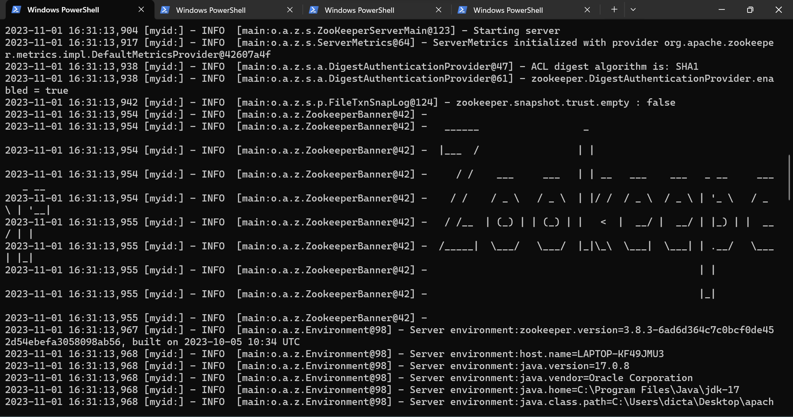
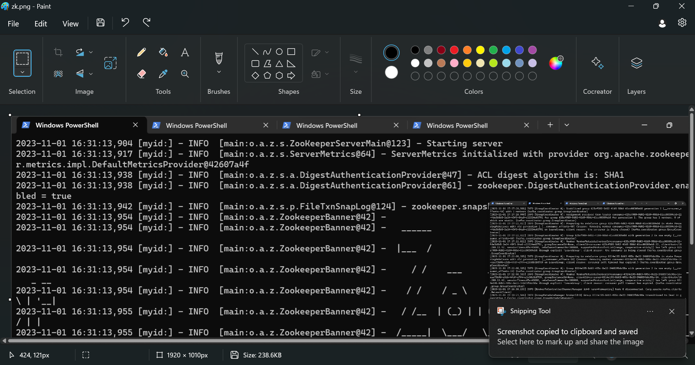
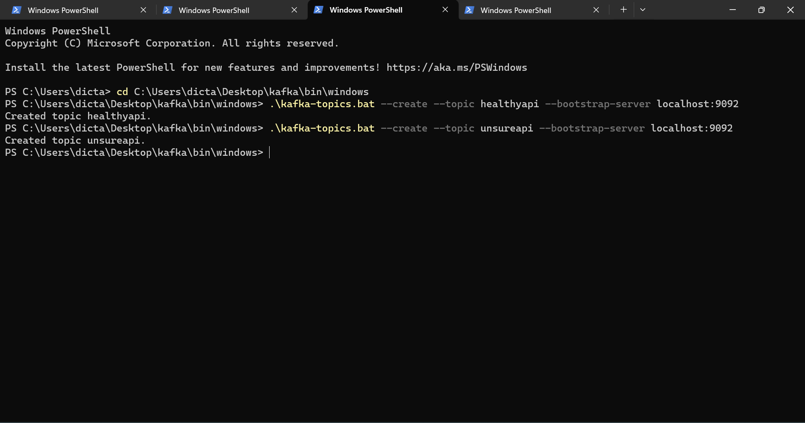
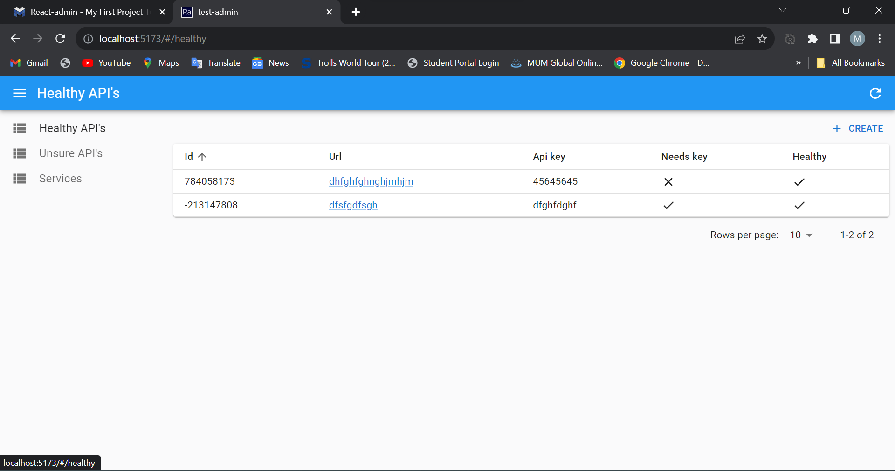

# Dashboard Services

## Backend Service

1- install and run `Zoo-keeper` by running this command
```
.\bin\zkServer.cmd
```

2- install and run `Kafka` with
```
.\windows\kafka-server-start.bat ..\config\server.properties
```

3- create the needed kafka topics
```
.\kafka-topics.bat --create --topic healthyapi --bootstrap-server localhost:9092
.\kafka-topics.bat --create --topic unsureapi --bootstrap-server localhost:9092
```

4- run `backend` spring boot service within Intellij.

## Frontend Server
frontend is built by using `react-admin` react package. to start the development server, run the following command inside `frontend` project root directory
```
npm install
npm run dev
```
